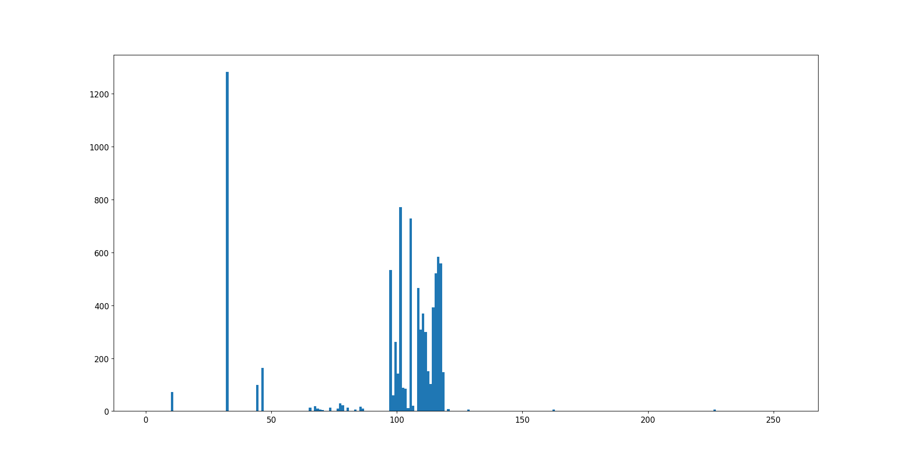

# Password-based encryption/decryption algorithm

This folder contains a password-based encryption algorithm, in which we can encrypt a file based on a password that can be of varying length (1 character to 100MB of characters)

---

## USAGE

To compile the code, use makefile:

```bash
$ make
```

To run the code (encrypt):

```bash
$ ls
. .. loremipsum.txt encrypt
$ ./encrypt <filename> [PASSWORD] (x-width of stream)
$ ls
. .. loremipsum.txt loremipsum_encrypted.txt encrypt
```

To decrypt the encrypted file:

```bash
$ ls
. .. loremipsum.txt loremipsum_encrypted.txt encrypt
$ ./encrypt <encrypted_filename> [PASSWORD] (x-width of stream)
$ ls
. .. loremipsum.txt loremipsum_encrypted.txt loremipsum_decrypted.txt encrypt
```

The x-length of the stream will decide the number of columns in the encryption matrix. For decryption, the user is required to use the same password and x-length as used during encryption.

## Analysis

A small analysis is done for the encryption algorithm. We took 2 documents, [prg.c](prg.c) and [Loremipsum.txt](Loremipsum.txt).

---

Results for prg.c (Frequency distribution of characters):

1. Before : .png>)
2. After: .png>)

---

Results for loremipsum.txt:

1. Before: 
2. After: .png>)

---

## Created by:

1. Ashwin Mittal

- encryptor.c
- encryptor.h
- CA.pdf

2. Varul Srivastava

- prg.c prg.h
- util.c util.h
- prg_paper.pdf
- analysis.py
