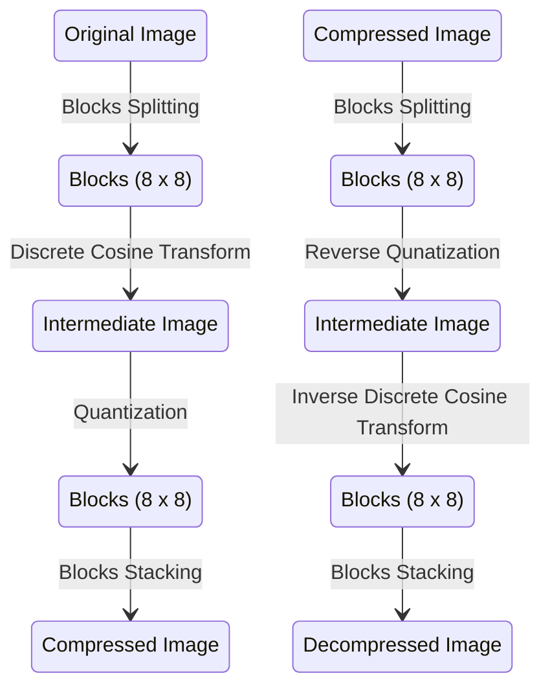
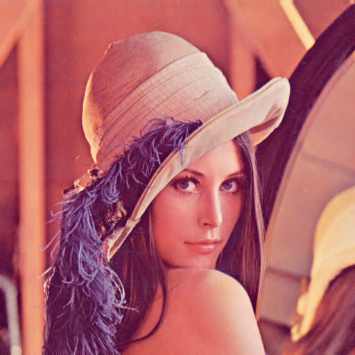
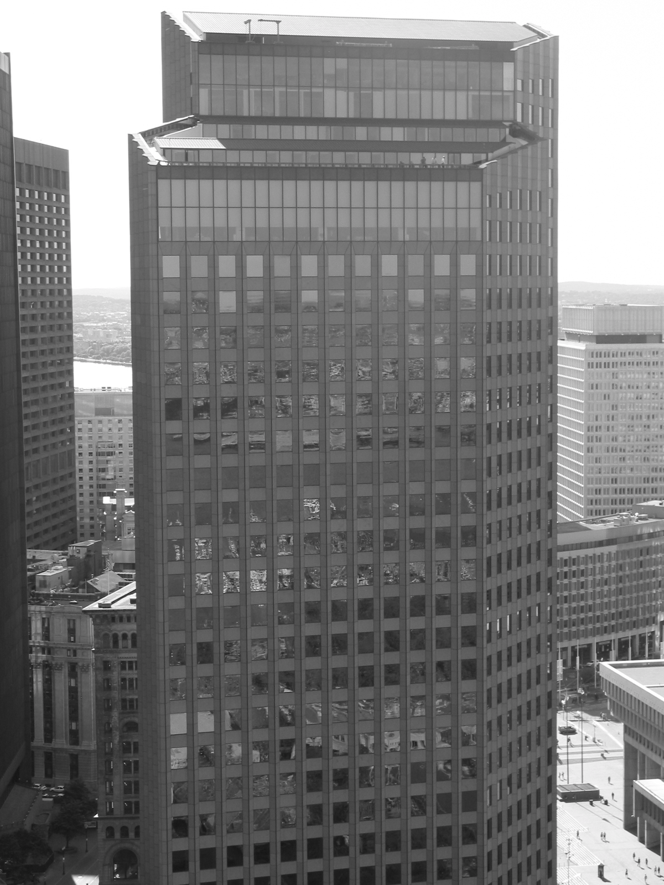

## JPEG COMPRESSION

> By Ashwin Mittal

## The Pipeline of the Algorithm

## Background

### The Process

The algorithm behind the JPEG standard comes from a Discrete Cosine Transform. The discrete cosine transform (DCT) expresses a finite sequence of data points regarding the sum of cosine functions oscillating at different frequencies. The DCT works by separating images into parts of differing frequencies. Therefore, an image can be represented with linear combinations of discrete cosine transform coefficients.

The top left DCT coefficient of the transformed image represents the lowest frequency. When we move to the bottom right corner, we are encountering DCT coefficients with higher frequencies. An image includes most of those frequencies. The human eye is good at seeing small differences in brightness over a relatively large area but not so good at distinguishing the exact strength of a high-frequency brightness variation. This allows one to reduce the amount of information in the high-frequency components significantly. This is done by simply dividing each element in the frequency domain by a constant for that component and then rounding to the nearest integer. The quantization is the only lossy part of the compression. The quantization matrix I am using here is a standard quantization matrix with a quality level of 50 that renders high compression and excellent decompressed image quality. Since the DCT coefficient will be divided by quantization matrices and then rounded to the nearest integer value element-wise, therefore higher value on the quantization matrices will cause higher compression to the image.

## Running

### Image-1 (x4.4 compression)

**Original Image (473831 bytes) | Compressed Image (107439 bytes) | Decompressed Image (365993 bytes)**

### Image-2 (x4.6 compression)

**Original Image (2022767 bytes) | Compressed Image (437772 bytes) | Decompressed Image (1260813 bytes)**

## Taken Forward

I will also add four more steps in the pipeline, namely Burrows-Wheeler transform, then run-length encoding, then Huffman compression, followed by cellular automata-based encryption, which will improve this compression rate more. This is possible in a compressed image because a compressed image has most of its pixel values the same.

### Try compressing your image!